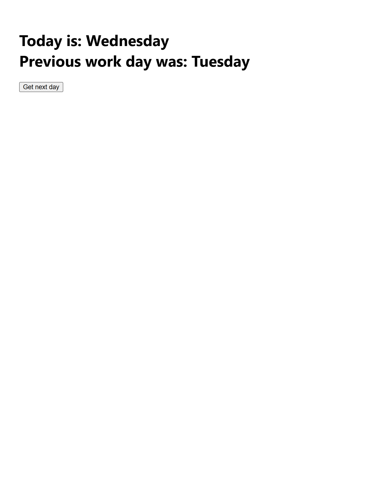

# Day Tracker Custom Hook

## Overview
The **Day Tracker Custom Hook** is a simple React application built with JSX as part of the *Advanced React* course on Coursera. The app displays the current day of the week and, after user interaction, shows both the current and previous day using a custom `usePrevious` hook. It demonstrates how to create a custom hook in React to track the previous value of a state variable, in this case, the day of the week.

## Functionality
The app initially displays:
- **Heading**: "Today is: Monday"
- **Button**: "Get next day"

When the user clicks the "Get next day" button, the app updates to show:
- **First Line**: The current day, e.g., "Today is: Tuesday"
- **Second Line**: The previous day, e.g., "Previous work day was: Monday"

This behavior is achieved using the `useState` hook to manage the `day` state, a custom `usePrevious` hook to store the previous day's value, and a `getNextDay` function to cycle through days (Monday to Friday, looping back to Monday). The `usePrevious` hook leverages `useRef` and `useEffect` to track the previous state value.

## Project Structure
- **App.jsx**: The main React component containing the `useState` hook, the custom `usePrevious` hook, the `getNextDay` function, and the JSX for rendering the day display and button.
- **index.jsx**: Entry point for the React application (not modified in this lab).

## Screenshot

## Technologies Used
- **React**: For building the user interface.
- **JSX**: For writing the component's UI structure.
- **React Hooks**: Including `useState`, `useEffect`, and `useRef` for state management and the custom `usePrevious` hook.
- **Create React App**: For the development environment.

## Learning Objectives
This project demonstrates:
- Creating a custom React hook (`usePrevious`) to track the previous value of a state variable.
- Using the `useRef` hook to persist values across renders without causing re-renders.
- Using the `useEffect` hook to update the ref value when the state changes.
- Managing state with the `useState` hook and handling user interactions with event handlers.
- Conditionally rendering UI elements based on state.